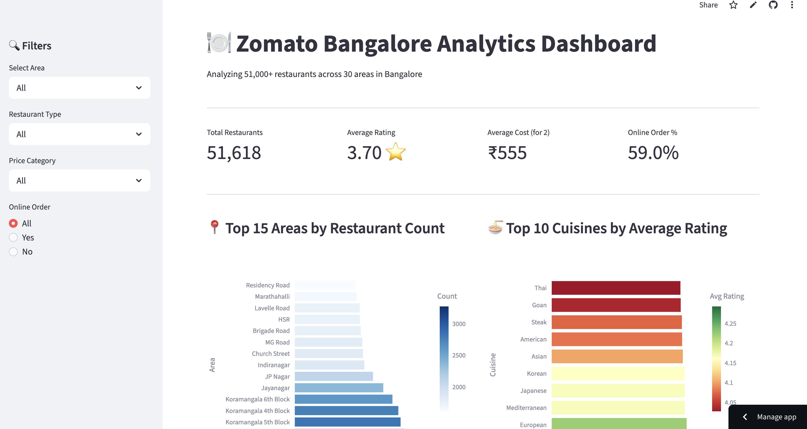
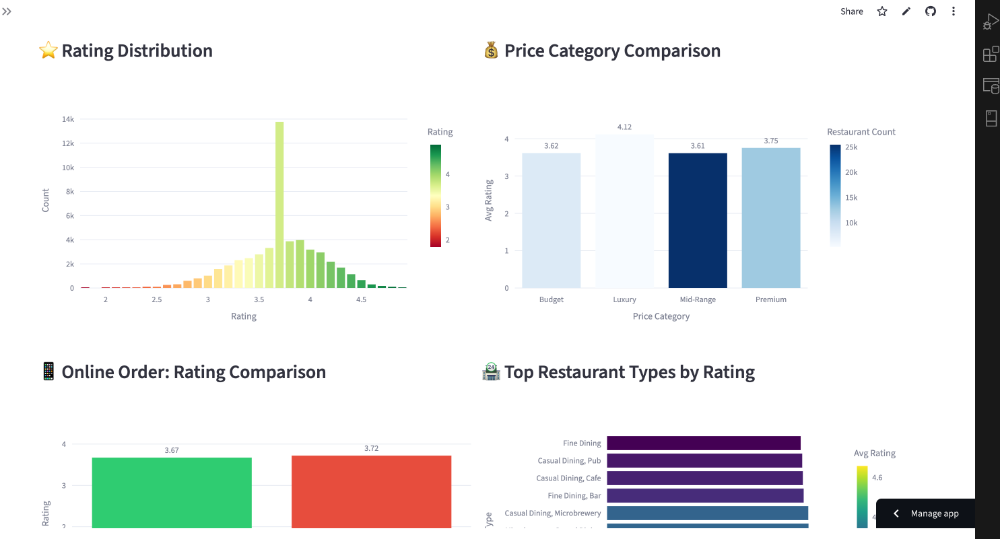
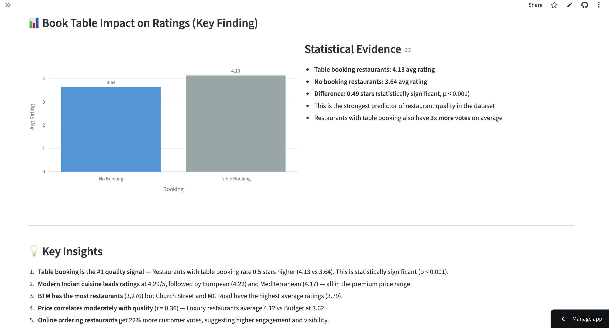

# 🍽️ Zomato Bangalore Analytics Dashboard

An interactive analytics dashboard analyzing **51,000+ restaurants** across 30 areas in Bangalore. Built with Python, SQL, and Streamlit.

## 🚀 Live Demo
**[➡ Click here to explore the dashboard](https://analytics-dashboard-cypt69dee6ftedaennmxgg.streamlit.app/)**

## 📸 Screenshots





## 💡 Key Findings

1. **Table booking is the #1 quality signal** — Restaurants with table booking rate 0.5 stars higher (4.13 vs 3.64). Statistically significant (p < 0.001).
2. **Modern Indian cuisine leads ratings** at 4.29/5, followed by European (4.22) and Mediterranean (4.17).
3. **BTM has the most restaurants** (3,276) but Church Street and MG Road have the highest average ratings (3.79).
4. **Price correlates moderately with quality** (r = 0.36) — Luxury restaurants average 4.12 vs Budget at 3.62.
5. **Online ordering restaurants** get 22% more customer votes, suggesting higher engagement.

## 🛠 Tech Stack

| Tool | Purpose |
|------|---------|
| Python / Pandas | Data cleaning and manipulation |
| SQL (SQLite) | Complex queries with window functions, CTEs |
| Plotly | Interactive visualizations |
| Streamlit | Dashboard framework and deployment |
| SciPy | Statistical hypothesis testing (t-tests, ANOVA, correlation) |

## 📊 SQL Analysis Highlights

The `src/sql_analysis.py` file contains 5 complex queries demonstrating:
- **GROUP BY** with aggregations and HAVING clauses
- **CASE WHEN** for conditional categorization
- **Window Functions** — RANK(), SUM() OVER(), NTILE()
- **CTEs** (Common Table Expressions) with PARTITION BY
- **Subqueries** for multi-level analysis

## 📈 Statistical Tests Performed

| Test | Question | Result |
|------|----------|--------|
| Independent t-test | Does online ordering affect ratings? | Yes, p < 0.001 |
| Pearson Correlation | Does cost correlate with rating? | r = 0.36, moderate positive |
| Independent t-test | Does table booking affect ratings? | Yes, 0.5 star difference, p < 0.001 |
| ANOVA | Do restaurant types differ in ratings? | Yes, F = 642.6, p < 0.001 |
| Pearson Correlation | Does cuisine count affect rating? | r = 0.19, weak positive |

## 📁 Project Structure

- **data/raw/** — Original Zomato CSV (not in repo, download from Kaggle)
- **data/processed/** — Cleaned dataset used by the dashboard
- **notebooks/** — Jupyter exploration notebook
- **src/data_loader.py** — Load raw data
- **src/data_cleaning.py** — Clean data + feature engineering
- **src/sql_analysis.py** — 5 complex SQL queries
- **src/analysis.py** — Statistical hypothesis testing
- **assets/** — Dashboard screenshots
- **app.py** — Streamlit dashboard
- **requirements.txt** — Python dependencies
- **README.md** — This file

## 🚀 How to Run Locally

```bash
# Clone the repository
git clone https://github.com/GirirajKudupudi/analytics-dashboard.git
cd analytics-dashboard

# Install dependencies
pip install -r requirements.txt

# Download Zomato dataset from Kaggle and place in data/raw/
# https://www.kaggle.com/datasets/rishikeshkonapure/zomato

# Run the data pipeline
python -m src.data_cleaning

# Launch the dashboard
streamlit run app.py
```

## 📚 Dataset

**Source:** [Zomato Bangalore Restaurants](https://www.kaggle.com/datasets/rishikeshkonapure/zomato) on Kaggle

**Size:** 51,717 restaurants | 17 columns | Bangalore, India

## 👤 Author

**Giriraj Kudupudi**
- MS Data Analytics
- [GitHub](https://github.com/GirirajKudupudi)
- [LinkedIn](https://linkedin.com/in/giriraj-kudupudi-6469ba192)
